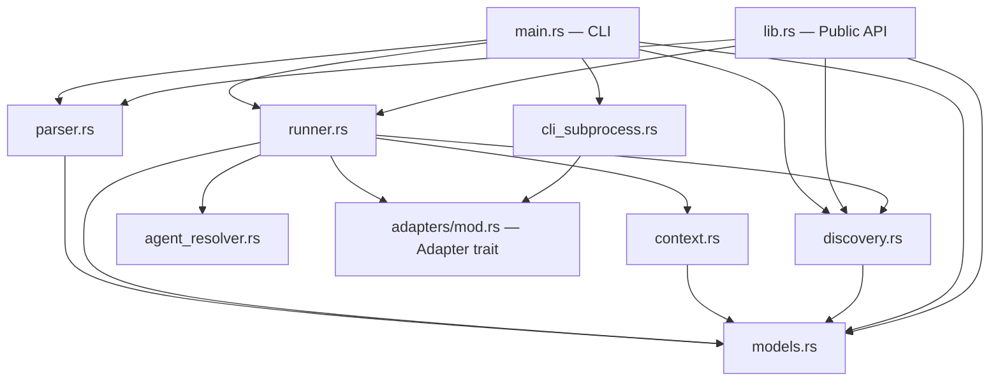

# Architecture — amplihack-recipe-runner

Rust implementation of the amplihack recipe runner. Parses YAML recipe files,
evaluates conditions in a sandboxed expression language, and executes steps
(bash commands, AI agent prompts, or nested sub-recipes) through a pluggable
adapter layer.

---

## Module Dependency Diagram

```
┌─────────────────────────────────────────────────────────────────────┐
│                           main.rs (CLI)                            │
│  clap args → parse → build runner → execute → format output        │
└──────┬──────────┬───────────┬──────────┬───────────┬───────────────┘
       │          │           │          │           │
       ▼          ▼           ▼          ▼           ▼
   parser.rs  runner.rs  discovery.rs  adapters/  models.rs
       │       │  │  │       │        cli_subprocess.rs
       │       │  │  │       │              │
       │       │  │  └───────┘              │
       │       │  │                         │
       │       ▼  ▼                         │
       │  context.rs  agent_resolver.rs     │
       │       │                            │
       └───────┴────────────────────────────┘
                  models.rs (shared types)
```



### Module Roles at a Glance

| Module               | Responsibility                                       |
|----------------------|------------------------------------------------------|
| `main.rs`            | CLI interface (clap), subcommands, output formatting  |
| `lib.rs`             | Public library API for embedding                      |
| `models.rs`          | Shared data types (Recipe, Step, StepResult, …)       |
| `parser.rs`          | YAML deserialization, validation, typo detection       |
| `context.rs`         | Template rendering, sandboxed condition evaluation     |
| `runner.rs`          | Orchestration: hooks, conditions, audit, recursion     |
| `agent_resolver.rs`  | Agent reference → markdown file resolution             |
| `discovery.rs`       | Multi-directory recipe discovery and manifest sync     |
| `adapters/mod.rs`    | `Adapter` trait definition                             |
| `adapters/cli_subprocess.rs` | Subprocess execution for bash and agent steps |

---

## Data Flow

```
  YAML file
      │
      ▼
 ┌──────────┐   file size check    ┌────────────┐
 │ parser.rs │ ──────────────────► │ serde_yaml  │
 └──────────┘   MAX_YAML_SIZE 1MB  │ deserialize │
      │                            └─────┬──────┘
      │  validate: name, steps,          │
      │  unique IDs, field typos         ▼
      │                           Recipe (models.rs)
      ▼
 ┌──────────┐   merge recipe.context
 │ runner.rs │   + user overrides (--set)
 └──────────┘
      │
      │  for each step:
      │    1. Tag filter (when_tags vs active/exclude)
      │    2. Condition evaluation (context.evaluate)
      │    3. Template rendering (context.render / render_shell)
      │    4. Dispatch: Bash │ Agent │ Sub-Recipe
      │    5. Optional JSON parse of output
      │    6. Store output in context
      │    7. Write JSONL audit entry
      │    8. Run post_step / on_error hook
      │
      ▼
 RecipeResult
   ├── success: bool
   ├── step_results: Vec<StepResult>
   ├── context: final variable state
   └── duration: wall-clock time
```

### Parse Phase

1. `RecipeParser::parse_file` reads the file and rejects anything over 1 MB
   (YAML bomb protection).
2. `serde_yaml` deserializes into `Recipe`. Step fields like `command`, `agent`,
   `prompt`, and `recipe` determine the implicit `StepType` via
   `Step::effective_type()`.
3. Structural validation: name must be non-empty, at least one step required,
   step IDs must be unique.
4. `validate_with_yaml` inspects raw YAML keys and reports unknown fields using
   edit-distance typo detection (e.g., "comand" → did you mean "command"?).

### Execute Phase

`RecipeRunner::execute` merges the recipe's `context` map with any user-supplied
`--set KEY=VALUE` overrides, then iterates steps sequentially:

1. **Tag filter** — `should_skip_by_tags` checks `when_tags` against
   `active_tags` / `exclude_tags`.
2. **Condition** — `RecipeContext::evaluate` runs a sandboxed boolean expression
   (see [Safety Model](#safety-model)).
3. **Dispatch** — routes to `execute_bash_step`, `execute_agent_step`, or
   `execute_sub_recipe` on the adapter.
4. **Output capture** — if `parse_json` is set, the runner tries three
   extraction strategies (direct parse → markdown fence → balanced brackets),
   with an optional retry that re-prompts the agent for JSON-only output.
5. **Context update** — step output is stored under `step.output` (or
   `step.id`) in the context for downstream templates.
6. **Hooks** — `pre_step` runs before dispatch, `post_step` after success,
   `on_error` after failure. Hook commands are rendered through the context.
7. **Audit** — each step result is appended to a JSONL file
   (`<audit_dir>/<recipe>_<timestamp>.jsonl`).

---

## Core Types (models.rs)

### Step

```rust
struct Step {
    id:                String,
    command:           Option<String>,       // Bash step
    agent:             Option<String>,       // Agent reference
    prompt:            Option<String>,       // Agent prompt
    recipe:            Option<String>,       // Sub-recipe name
    output:            Option<String>,       // Context variable for result
    condition:         Option<String>,       // Boolean expression
    parse_json:        Option<bool>,         // Auto-parse output as JSON
    mode:              Option<String>,       // Execution mode
    working_dir:       Option<String>,       // Override cwd
    timeout:           Option<u64>,          // Seconds
    auto_stage:        Option<bool>,         // git add -A after agent steps
    continue_on_error: Option<bool>,         // Don't fail-fast
    when_tags:         Option<Vec<String>>,  // Tag-based filtering
    parallel_group:    Option<String>,       // Concurrent step grouping (fully implemented)
    sub_context:       Option<HashMap<…>>,   // Context overrides for sub-recipe
}
```

`Step::effective_type()` infers the step type from which fields are present:
`recipe` → Recipe, `agent`/`prompt` → Agent, `command` → Bash.

### Recipe

```rust
struct Recipe {
    name:        String,
    version:     Option<String>,
    description: Option<String>,
    author:      Option<String>,
    tags:        Option<Vec<String>>,
    context:     Option<HashMap<String, Value>>,
    steps:       Vec<Step>,
    recursion:   Option<RecursionConfig>,   // max_depth (6), max_total_steps (200)
    hooks:       Option<RecipeHooks>,       // pre_step, post_step, on_error
    extends:     Option<String>,            // Parent recipe (inheritance)
}
```

### Result Types

```rust
struct StepResult {
    step_id:  String,
    status:   StepStatus,   // Pending | Running | Completed | Skipped | Failed
    output:   Option<String>,
    error:    Option<String>,
    duration: Duration,
}

struct RecipeResult {
    recipe_name:  String,
    success:      bool,
    step_results: Vec<StepResult>,
    context:      HashMap<String, Value>,   // Final state (skipped in JSON serialization)
    duration:     Duration,
}
```

---

## CLI Interface (main.rs)

```
amplihack-recipe-runner [OPTIONS] [RECIPE] [COMMAND]

Commands:
  run    Execute a recipe file (default)
  list   List discovered recipes

Arguments:
  [RECIPE]   Path to a .yaml recipe file

Options:
  -C, --working-dir <DIR>        Working directory (default: ".")
  -R, --recipe-dir <DIR>         Additional recipe search directories (repeatable)
      --set <KEY=VALUE>           Context variable overrides (repeatable)
      --dry-run                   Log steps without executing
      --validate-only             Parse and validate, then exit
      --explain                   Print step plan without executing
      --progress                  Emit progress to stderr (StderrListener)
      --include-tags <TAGS>       Only run steps matching these tags (comma-separated)
      --exclude-tags <TAGS>       Skip steps matching these tags (comma-separated)
      --audit-dir <DIR>           Directory for JSONL audit logs
      --output-format <FMT>      Output format: text (default) or json
```

`--set` values are auto-typed: JSON objects/arrays are parsed as-is, `true`/`false`
become booleans, numeric strings become numbers, everything else stays a string.

---

## Adapter Pattern

The `Adapter` trait decouples the runner from any specific execution backend:

```rust
trait Adapter {
    fn execute_agent_step(
        &self, prompt: &str, agent_name: &str,
        system_prompt: Option<&str>, mode: Option<&str>,
        working_dir: Option<&str>,
    ) -> Result<String>;

    fn execute_bash_step(
        &self, command: &str, working_dir: Option<&str>,
        timeout: Option<u64>,
    ) -> Result<String>;

    fn is_available(&self) -> bool;
    fn name(&self) -> &str;
}
```

### CLISubprocessAdapter

The production adapter spawns subprocesses:

- **Bash steps** — `/bin/bash -c <command>`, optionally wrapped with `timeout`.
- **Agent steps** — `claude -p <prompt>` in an isolated temp directory. A
  `NON_INTERACTIVE_FOOTER` ("Proceed autonomously. Do not ask questions.") is
  appended to prevent the nested Claude session from hanging on prompts.

**Timeout enforcement**: A background heartbeat thread monitors the deadline.
It logs progress every 2 seconds. On expiry it sends `SIGTERM`, waits 5 seconds,
then escalates to `SIGKILL`.

**Environment propagation**: `build_child_env()` forwards session-tracking
variables (`AMPLIHACK_SESSION_DEPTH`, `AMPLIHACK_TREE_ID`, `AMPLIHACK_MAX_DEPTH`,
`AMPLIHACK_MAX_SESSIONS`) and strips `CLAUDECODE` to prevent nested session
confusion.

---

## Execution Flow

### Lifecycle of a Recipe Run

```
CLI args
  │
  ├─ --validate-only ──► parse + validate ──► print warnings ──► exit
  ├─ --explain ─────────► parse ──► print step plan ──► exit
  │
  ▼
RecipeRunner::execute(recipe, user_context)
  │
  ├─ Check recursion limits (depth ≤ max_depth, total_steps ≤ max_total_steps)
  ├─ Merge recipe.context + user_context
  ├─ Open JSONL audit log (if --audit-dir set)
  │
  │  ┌─── for each step ──────────────────────────────────────────┐
  │  │                                                             │
  │  │  1. should_skip_by_tags(step) ──► skip if filtered out      │
  │  │  2. run_hook(pre_step)                                      │
  │  │  3. evaluate condition ──► Skipped if false                 │
  │  │  4. render templates in command/prompt                      │
  │  │  5. dispatch:                                               │
  │  │     ├─ Bash  → adapter.execute_bash_step()                  │
  │  │     ├─ Agent → resolve agent, adapter.execute_agent_step()  │
  │  │     └─ Recipe → execute_sub_recipe() (recursive)            │
  │  │  6. parse JSON output (if parse_json, with retry)           │
  │  │  7. store output in context                                 │
  │  │  8. maybe_auto_stage (git add -A for agent steps)           │
  │  │  9. run_hook(post_step) or run_hook(on_error)               │
  │  │ 10. write JSONL audit entry                                 │
  │  │ 11. fail-fast unless continue_on_error                      │
  │  │                                                             │
  │  └─────────────────────────────────────────────────────────────┘
  │
  ▼
RecipeResult { success, step_results, context, duration }
```

### Sub-Recipe Execution

When a step has `step_type: Recipe`:

1. The runner searches for the recipe file using `discovery::find_recipe` across
   `recipe_search_dirs`, then falls back to a direct path relative to
   `working_dir`.
2. Recursion depth is checked against `RecursionConfig::max_depth` (default 6).
   `total_steps` is checked against `max_total_steps` (default 200).
3. The sub-recipe's context inherits from the parent context, merged with any
   `sub_context` overrides defined on the step.
4. A new `execute_with_depth(recipe, context, depth + 1)` call runs the
   sub-recipe. Depth and total-step counters are tracked via `Cell<u32>`.
5. After execution, the sub-recipe's final context is propagated back into the
   parent context.

### Hooks

Defined in `RecipeHooks`:

```yaml
hooks:
  pre_step: "echo 'Starting step {{step_id}}'"
  post_step: "echo 'Completed step {{step_id}}'"
  on_error: "notify-send 'Step {{step_id}} failed'"
```

Hooks are shell commands rendered through the context. `pre_step` runs before
every step dispatch. `post_step` runs after a successful step. `on_error` runs
after a failed step. Hook failures are logged but do not abort the recipe.

### Execution Listeners

The `ExecutionListener` trait provides real-time progress callbacks:

```rust
trait ExecutionListener {
    fn on_step_start(&self, step_id: &str, step_type: &str);
    fn on_step_complete(&self, result: &StepResult);
    fn on_output(&self, step_id: &str, line: &str);
}
```

| Implementation   | Behavior                                      |
|------------------|-----------------------------------------------|
| `NullListener`   | No-op (default)                               |
| `StderrListener` | Emits progress emojis and timing to stderr    |

Activated with `--progress`.

---

## Safety Model

### Condition Evaluator (context.rs)

The condition evaluator is a hand-written recursive descent parser that
evaluates boolean expressions over recipe context variables. It does **not**
call `eval()` or execute arbitrary code.

**Supported syntax:**

```
status == "ok" and (retries < 3 or force == true)
len(items) > 0
name.startswith("test_")
value not in "blocked,disabled"
```

**Operator precedence** (low → high): `or`, `and`, `not`, comparison
(`==`, `!=`, `<`, `<=`, `>`, `>=`, `in`, `not in`).

**Security constraints:**

| Rule                        | Rationale                                    |
|-----------------------------|----------------------------------------------|
| No `__` (dunder) access     | Blocks dunder attribute introspection        |
| Whitelisted functions only  | `int`, `str`, `len`, `bool`, `float`, `min`, `max` |
| Whitelisted methods only    | `strip`, `lower`, `upper`, `startswith`, `endswith`, `replace`, `split`, `join`, `count`, `find`, and variants |
| No assignment operators     | Expressions are read-only                    |
| No function definitions     | Grammar does not support `fn`, `def`, `lambda` |

The tokenizer produces typed tokens (`String`, `Number`, `Ident`, `Eq`,
`And`, `Or`, …) and the parser consumes them with lookahead. Unrecognized
tokens produce a parse error rather than silent misbehavior.

### Template Rendering

`RecipeContext::render` replaces `{{var}}` placeholders with values from the
context. Dot-notation (`{{obj.nested.key}}`) traverses into JSON objects.
Missing variables render as empty strings.

`RecipeContext::render_shell` does the same but shell-escapes every substituted
value to prevent injection in bash commands.

### Agent Resolver Path Safety (agent_resolver.rs)

Agent references use a namespaced format (`namespace:category:name` or
`namespace:name`). Each segment is validated against:

```rust
static SAFE_NAME_RE: Regex = Regex::new(r"^[a-zA-Z0-9_-]+$");
```

This rejects `/`, `..`, and any characters that could enable path traversal.

As defense-in-depth, after resolving the file path, the resolver canonicalizes
both the candidate path and the search base directory, then verifies the
resolved path is a child of the search base. This defends against symlink
attacks.

### Parser Protections (parser.rs)

- **File size limit**: 1 MB (`MAX_YAML_SIZE_BYTES`). Prevents YAML bombs and
  memory exhaustion.
- **Structural validation**: Rejects empty names, zero-step recipes, and
  duplicate step IDs.
- **Field typo detection**: Unknown top-level and step-level fields trigger
  warnings. Edit-distance matching suggests corrections.

### Subprocess Isolation (cli_subprocess.rs)

- Agent steps execute in a fresh temporary directory that is cleaned up on drop.
- `CLAUDECODE` is stripped from the child environment to prevent the nested
  Claude process from attaching to the parent's session.
- Session depth tracking (`AMPLIHACK_SESSION_DEPTH`) prevents runaway recursive
  spawning.

---

## Interior Mutability Pattern

The runner tracks recursion state with `std::cell::Cell<u32>`:

```rust
struct RecipeRunner<A: Adapter> {
    // ...
    depth:       Cell<u32>,
    total_steps: Cell<u32>,
    // ...
}
```

### Why Cell?

`RecipeRunner::execute` takes `&self` (shared reference) because the runner is
logically immutable during a run — the adapter, working directory, tag filters,
and listener never change. But recursion tracking requires mutating two counters.

`Cell<u32>` provides interior mutability for `Copy` types without runtime
borrow-checking overhead (no `RefCell` needed). The runner is single-threaded,
so `Cell` is sufficient and zero-cost.

### Usage in Recursion

```
execute(&self, recipe, context)
    │
    ├─ self.depth.get() checked against max_depth
    ├─ self.total_steps.get() checked against max_total_steps
    │
    └─ execute_sub_recipe(&self, step, ctx)
         │
         ├─ self.depth.set(self.depth.get() + 1)
         ├─ execute_with_depth(&self, sub_recipe, ctx, new_depth)
         └─ self.total_steps.set(self.total_steps.get() + sub_step_count)
```

The `RecursionConfig` defaults (`max_depth: 6`, `max_total_steps: 200`) can be
overridden per-recipe in the YAML:

```yaml
recursion:
  max_depth: 3
  max_total_steps: 50
```

---

## Recipe Discovery (discovery.rs)

### Search Directories (default order)

1. `~/.amplihack/.claude/recipes`
2. `./amplifier-bundle/recipes`
3. `./src/amplihack/amplifier-bundle/recipes`
4. `./.claude/recipes`

Additional directories can be added with `-R <dir>` (repeatable).

### Discovery Functions

| Function              | Purpose                                                |
|-----------------------|--------------------------------------------------------|
| `discover_recipes`    | Scan directories, return `HashMap<name, RecipeInfo>`   |
| `list_recipes`        | Sorted `Vec<RecipeInfo>` for display                   |
| `find_recipe`         | Locate a single recipe by name → `Option<PathBuf>`     |
| `verify_global_installation` | Check that default dirs exist and contain recipes |

### Manifest & Upstream Sync

`update_manifest` writes `_recipe_manifest.json` — a map of filenames to their
SHA-256 hashes (first 16 hex chars). `check_upstream_changes` diffs the current
directory state against the manifest and reports `new`, `modified`, or `deleted`
files.

`sync_upstream` adds a git remote, fetches, and diffs local recipes against the
upstream branch, returning a summary of changes.

---

## JSONL Audit Log

When `--audit-dir` is set, each recipe run produces a file:

```
<audit-dir>/<recipe-name>_<ISO-timestamp>.jsonl
```

Each line is a JSON object:

```json
{"step_id": "build", "status": "Completed", "duration_ms": 1423, "error": null, "output_len": 256}
```

Audit logs enable post-hoc analysis of recipe execution without cluttering
stdout.

---

## JSON Output Extraction

When `parse_json: true` is set on a step, the runner extracts structured JSON
from potentially noisy output using three strategies (tried in order):

1. **Direct parse** — `serde_json::from_str(output)`. Works when the output is
   pure JSON.
2. **Markdown fence** — extracts content between ` ```json ` and ` ``` `
   delimiters. Common in LLM output.
3. **Balanced brackets** — finds the first `{` or `[` and matches it to its
   closing counterpart, counting nesting depth.

If all three fail, the runner optionally **retries** the agent step with a
JSON-only reminder appended to the prompt, then re-applies the extraction
pipeline.
