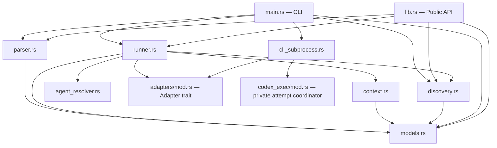

# Architecture — amplihack-recipe-runner

Rust implementation of the amplihack recipe runner. Parses YAML recipe files,
evaluates conditions in a sandboxed expression language, and executes steps
(bash commands, AI agent prompts, or nested sub-recipes) through a pluggable
adapter layer.

## Contents

- [Module dependency diagram](#module-dependency-diagram)
- [Data flow](#data-flow)
- [Core types](#core-types-modelsrs)
- [CLI interface](#cli-interface-mainrs)
- [Adapter pattern](#adapter-pattern)
- [Execution flow](#execution-flow)
- [Safety model](#safety-model)
- [Interior mutability](#interior-mutability-pattern)
- [Recipe discovery](#recipe-discovery-discoveryrs)
- [JSONL audit log](#jsonl-audit-log)
- [JSON output extraction](#json-output-extraction)

---

## Module Dependency Diagram

```
┌─────────────────────────────────────────────────────────────────────┐
│                           main.rs (CLI)                            │
│  clap args → parse → build runner → execute → format output        │
└──────┬──────────┬───────────┬──────────┬───────────┬───────────────┘
       │          │           │          │           │
       ▼          ▼           ▼          ▼           ▼
   parser.rs  runner.rs  discovery.rs  adapters/  models.rs
       │       │  │  │       │        cli_subprocess.rs
       │       │  │  │       │              │
       │       │  │  └───────┘              │
       │       │  │                         │
       │       ▼  ▼                         │
       │  context.rs  agent_resolver.rs     │
       │       │                            │
       └───────┴────────────────────────────┘
                  models.rs (shared types)
```


```mermaid
graph TD
    main[main.rs — CLI] --> parser[parser.rs]
    main --> runner[runner.rs]
    main --> discovery[discovery.rs]
    main --> cli_sub[cli_subprocess.rs]

    lib[lib.rs — Public API] --> parser
    lib --> runner
    lib --> discovery

    runner --> context[context.rs]
    runner --> agent_resolver[agent_resolver.rs]
    runner --> discovery
    runner --> adapters[adapters/mod.rs — Adapter trait]

    cli_sub --> adapters
    cli_sub --> codex_exec[codex_exec/mod.rs — private attempt coordinator]

    parser --> models[models.rs]
    runner --> models
    context --> models
    discovery --> models
    main --> models
    lib --> models
```

### Module Roles at a Glance

| Module               | Responsibility                                       |
|----------------------|------------------------------------------------------|
| `main.rs`            | CLI interface (clap), subcommands, output formatting  |
| `lib.rs`             | Public library API for embedding                      |
| `models.rs`          | Shared data types (Recipe, Step, StepResult, …)       |
| `parser.rs`          | YAML deserialization, validation, typo detection       |
| `context.rs`         | Template rendering, sandboxed condition evaluation     |
| `runner.rs`          | Orchestration: hooks, conditions, audit, recursion     |
| `agent_resolver.rs`  | Agent reference → markdown file resolution             |
| `discovery.rs`       | Multi-directory recipe discovery and manifest sync     |
| `adapters/mod.rs`    | `Adapter` trait definition                             |
| `adapters/cli_subprocess.rs` | Provider dispatch, subprocess execution and rate-limit retries |
| `adapters/codex_exec/mod.rs` | Private attempt coordination and typed error composition |
| `adapters/codex_exec/cancellation.rs` | Shared signal epochs, full disposition restoration and cancellation snapshot before ownership unlock |
| `adapters/codex_exec/signal_observations.rs` | Persistent per-signal observable-entry publication without epoch resets |
| `adapters/codex_exec/process.rs` | Owned child/group, complete stdin delivery, deadline and bounded shutdown |
| `adapters/codex_exec/group_anchor.rs` | Non-cloneable retained group authority through final destructive access |
| `adapters/codex_exec/anchor_io.rs` / `anchor_child.rs` | Bounded private helper readiness, descriptor isolation and lifetime |
| `adapters/codex_exec/launcher_cleanup.rs` | Direct-launcher retirement within shared absolute cleanup deadlines |
| `adapters/codex_exec/diagnostics.rs` | Bounded pipe readers and secret-safe exit classification |
| `adapters/codex_exec/final_output.rs` | Descriptor validation and exact bounded UTF-8 final-message reads |

---

## Data Flow

```
  YAML file
      │
      ▼
 ┌──────────┐   file size check    ┌────────────┐
 │ parser.rs │ ──────────────────► │ serde_yaml  │
 └──────────┘   MAX_YAML_SIZE 1MB  │ deserialize │
      │                            └─────┬──────┘
      │  validate: name, steps,          │
      │  unique IDs, field typos         ▼
      │                           Recipe (models.rs)
      ▼
 ┌──────────┐   merge recipe.context
 │ runner.rs │   + user overrides (--set)
 └──────────┘
      │
      │  for each step:
      │    1. Tag filter (when_tags vs active/exclude)
      │    2. Condition evaluation (context.evaluate)
      │    3. Template rendering (context.render / render_shell)
      │    4. Dispatch: Bash │ Agent │ Sub-Recipe
      │    5. Optional JSON parse of output
      │    6. Store output in context
      │    7. Write JSONL audit entry
      │    8. Run post_step / on_error hook
      │
      ▼
 RecipeResult
   ├── success: bool
   ├── step_results: Vec<StepResult>
   ├── context: final variable state
   └── duration: wall-clock time
```

### Early Capability Dispatch

`main.rs` handles exact standalone `--capabilities` before logger initialization
and update checks. It emits the frozen schema/version/capability JSON; mixed
invocations fail before execution or update effects. See the
[probe contract](codex-exec.md#compatibility-probe-api).

### Parse Phase

1. `RecipeParser::parse_file` reads the file and rejects anything over 1 MB
   (YAML bomb protection).
2. `serde_yaml` deserializes into `Recipe`. Step fields like `command`, `agent`,
   `prompt`, and `recipe` determine the implicit `StepType` via
   `Step::effective_type()`.
3. Structural validation: name must be non-empty, at least one step required,
   step IDs must be unique.
4. `validate_with_yaml` inspects raw YAML keys and reports unknown fields using
   edit-distance typo detection (e.g., "comand" → did you mean "command"?).

### Execute Phase

`RecipeRunner::execute` merges the recipe's `context` map with any user-supplied
`--set KEY=VALUE` overrides, then iterates steps sequentially:

1. **Tag filter** — `should_skip_by_tags` checks `when_tags` against
   `active_tags` / `exclude_tags`.
2. **Condition** — `RecipeContext::evaluate` runs a sandboxed boolean expression
   (see [Safety Model](#safety-model)).
3. **Dispatch** — routes to `execute_bash_step`, `execute_agent_step`, or
   `execute_sub_recipe` on the adapter.
4. **Output capture** — if `parse_json` is set, the runner tries three
   extraction strategies (direct parse → markdown fence → balanced brackets),
   with an optional retry that re-prompts the agent for JSON-only output.
5. **Context update** — step output is stored under `step.output` (or
   `step.id`) in the context for downstream templates.
6. **Hooks** — `pre_step` runs before dispatch, `post_step` after success,
   `on_error` after failure. Hook commands are rendered through the context.
7. **Audit** — each step result is appended to a JSONL file
   (`<audit_dir>/<recipe>_<timestamp>.jsonl`).

---

## Core Types (models.rs)

### Step

```rust
struct Step {
    id:                String,
    command:           Option<String>,       // Bash step
    agent:             Option<String>,       // Agent reference
    prompt:            Option<String>,       // Agent prompt
    recipe:            Option<String>,       // Sub-recipe name
    output:            Option<String>,       // Context variable for result
    condition:         Option<String>,       // Boolean expression
    parse_json:        Option<bool>,         // Auto-parse output as JSON
    mode:              Option<String>,       // Execution mode
    working_dir:       Option<String>,       // Override cwd
    timeout:           Option<u64>,          // Seconds
    auto_stage:        Option<bool>,         // git add -A after agent steps
    continue_on_error: Option<bool>,         // Don't fail-fast
    when_tags:         Option<Vec<String>>,  // Tag-based filtering
    parallel_group:    Option<String>,       // Concurrent step grouping (fully implemented)
    sub_context:       Option<HashMap<…>>,   // Context overrides for sub-recipe
}
```

`Step::effective_type()` infers the step type from which fields are present:
`recipe` → Recipe, `agent`/`prompt` → Agent, `command` → Bash.

### Recipe

```rust
struct Recipe {
    name:        String,
    version:     Option<String>,
    description: Option<String>,
    author:      Option<String>,
    tags:        Option<Vec<String>>,
    context:     Option<HashMap<String, Value>>,
    steps:       Vec<Step>,
    recursion:   Option<RecursionConfig>,   // max_depth (6), max_total_steps (200)
    hooks:       Option<RecipeHooks>,       // pre_step, post_step, on_error
    extends:     Option<String>,            // Parent recipe (inheritance)
}
```

### Result Types

```rust
struct StepResult {
    step_id:  String,
    status:   StepStatus,   // Pending | Running | Completed | Skipped | Failed
    output:   Option<String>,
    error:    Option<String>,
    duration: Duration,
}

struct RecipeResult {
    recipe_name:  String,
    success:      bool,
    step_results: Vec<StepResult>,
    context:      HashMap<String, Value>,   // Final state (skipped in JSON serialization)
    duration:     Duration,
}
```

---

## CLI Interface (main.rs)

```
recipe-runner-rs [OPTIONS] [RECIPE] [COMMAND]

Commands:
  list   List discovered recipes

Arguments:
  [RECIPE]   Path to a .yaml recipe file

Options:
  -C, --working-dir <DIR>        Working directory (default: ".")
  -R, --recipe-dir <DIR>         Additional recipe search directories (repeatable)
      --set <KEY=VALUE>           Context variable overrides (repeatable)
      --dry-run                   Log steps without executing
      --validate-only             Parse and validate, then exit
      --explain                   Print step plan without executing
      --progress                  Emit progress to stderr (StderrListener)
      --include-tags <TAGS>       Only run steps matching these tags (comma-separated)
      --exclude-tags <TAGS>       Skip steps matching these tags (comma-separated)
      --audit-dir <DIR>           Directory for JSONL audit logs
      --output-format <FMT>      Output format: text (default) or json
```

`--set` values are auto-typed: JSON objects/arrays are parsed as-is, `true`/`false`
become booleans, numeric strings become numbers, everything else stays a string.

---

## Adapter Pattern

The `Adapter` trait decouples the runner from any specific execution backend:

```rust
pub trait Adapter: Sync {
    fn execute_agent_step(
        &self,
        prompt: &str,
        agent_name: Option<&str>,
        system_prompt: Option<&str>,
        mode: Option<&str>,
        working_dir: &str,
        model: Option<&str>,
        timeout: Option<u64>,
    ) -> Result<String, anyhow::Error>;

    fn execute_bash_step(
        &self,
        command: &str,
        working_dir: &str,
        timeout: Option<u64>,
        extra_env: &std::collections::HashMap<String, String>,
    ) -> Result<String, anyhow::Error>;

    fn is_available(&self) -> bool;
    fn name(&self) -> &str;
}
```

### CLISubprocessAdapter

The production adapter spawns subprocesses:

- **Bash steps** — `<bash> -c <command>`, or `<bash> <script-file>` when the
  command exceeds 64 KiB, optionally wrapped with `timeout`. `<bash>` is a
  single absolute path resolved in the parent process (see
  [Bash interpreter resolution](#bash-interpreter-resolution)). Lifecycle hooks
  (`pre_step`, `post_step`, `on_error`) take the same path, with a fixed 30 s
  timeout.
- **Agent steps** — dispatch by selected provider through `amplihack`.
  Claude/Copilot retain their existing transport and result contracts. Codex uses
  `amplihack codex -- exec --output-last-message UNIQUE_FINAL_PATH
  [--model EXPLICIT_MODEL] -` in the effective workspace, without implicit
  `--add-dir` or model selection. Full system/persona, leaf/no-reentry, task and
  autonomy instructions are delivered through stdin for every prompt size.

### Private Codex execution ownership

**[PLANNED — Implementation pending]** The lifecycle changes below specify the
intended ownership and retirement contract.

`cli_subprocess.rs` constructs the full stdin envelope and typed command arguments,
allocates a fresh private temporary directory for each attempt, and owns retry
policy and resource removal. Temporary resources use the platform temporary
location, honoring `TMPDIR`; the directory is private and the final pathname is
absent before launch. There is no additional public adapter API.

The private `adapters/codex_exec/` modules divide the attempt by responsibility:

- `mod.rs` coordinates spawn, delivery/wait, teardown and result classification.
  It composes primary, cleanup and immutable cancellation-retirement results,
  retaining both downcastable `Interruption` and `CleanupFailure` markers.
- `cancellation.rs` owns reference-counted SIGINT/SIGTERM registration. The first
  active owner saves full prior dispositions and captures a baseline before
  installation; concurrent owners share it. Nonlast close snapshots under the
  ownership mutex. Last close
  attempts both restorations and constructs an immutable observation/restoration
  result before unlocking. Failed restoration retains original actions and pending
  metadata for bounded reconciliation or refusal before a later spawn. The scope
  spans retries and backoff.
- `signal_observations.rs` publishes observable handler entry through persistent,
  target-proven lock-free per-signal saturating sequences, never reset between
  owners. Handlers perform no blocking, allocation or epoch-dependent later writes.
  Published entered/in-flight events during restoration are covered; a
  kernel-selected old handler first publishing after the retirement snapshot is
  outside demonstrated epoch attribution. Saturation is a typed terminal fault.
- `process.rs` owns the launcher, nonblocking complete stdin delivery and one
  absolute attempt deadline computed immediately after successful spawn. Anchor
  and reader setup, delivery and execution consume that same deadline.
- `group_anchor.rs`, `anchor_io.rs` and `anchor_child.rs` establish private retained
  membership in the original Unix group before any launcher polling can reap it.
  Readiness requires descriptor isolation and child-local signal policy. The
  non-cloneable anchor holds group authority through the final destructive call;
  a numeric PGID alone never authorizes signaling.
- `launcher_cleanup.rs` retires the direct launcher before anchored group TERM
  and KILL. Initial reap, direct TERM with at most 100 ms grace, direct KILL if
  still owned/live and PID-specific reap share cleanup start plus two seconds.
  Group TERM has at most 100 ms grace; TERM/probe errors do not skip the final
  KILL while authority remains. That KILL attempt seals destructive group access,
  including on failure. Helper fallback/reap and final observational confirmation
  share KILL-attempt completion plus two seconds. The helper is reaped before
  confirmation; exhausted budgets still permit a final observation without a new
  wait window. EINTR, fallback and Drop never renew these deadlines.
- `diagnostics.rs` drains both pipes concurrently, retaining 64 KiB tails.
  Stopped readers finish within a 50 ms or 1 MiB additional-read bound. Exit
  classification uses fixed actionable categories, including late stderr
  rate-limit evidence, without exposing raw provider output or credentials.
- `final_output.rs` validates the opened descriptor using no-follow and
  nonblocking flags, regular-file type, ownership and permissions. Metadata
  checks and a limit-plus-one read enforce the 10,000,000-byte output bound
  before unbounded allocation. Strict UTF-8 decoding preserves all content,
  including an empty message and whitespace.

After spawn, every outcome attempts bounded cleanup: close stdin, retire the
launcher, tear down the original group while authority remains, seal signaling,
retire/reap the helper, observe the group, then stop and join diagnostic readers.
Lost authority prohibits uncertain direct/group signals; cleanup continues for
positively owned resources and aggregates genuine signal, probe, reap, reader
and resource failures. Complete reaping and group absence are success conditions,
not guarantees after cleanup failure. Later absence cannot erase an earlier
genuine failure. Final-file extraction requires complete stdin delivery,
successful process exit and successful lifecycle cleanup. The adapter explicitly
closes temporary resources before returning; removal failure is terminal. Exit zero or
an existing final file alone cannot establish success; progress output never
substitutes for a missing final message, and oversized output fails rather than
being truncated.

Typed cancellation takes precedence while retaining both terminal markers and
primary diagnostics when cleanup also fails. Cancellation and genuine cleanup
failure stop pending dispatch before joins; already admitted work is joined.
Both stop the enclosing recipe despite `continue_on_error` or `fatal: false`,
including nested execution, parallel scheduling and JSON repair. Recorded
interruption prevents agentic recovery from starting; interruption during
recovery aborts the enclosing recipe. No rate-limit retry, automatic model
fallback or JSON repair runs after cancellation. Already running parallel Bash
steps retain their existing join behavior. Ordinary failures retain the
established recovery and nonfatal policies.

**Timeout enforcement**: Codex's per-attempt deadline includes anchor and reader
setup, stdin delivery and execution. Establishment is capped at 100 ms and the
remaining attempt time. Cleanup uses shared absolute deadlines with at most
4.1 seconds of process polling plus existing reader/resource bounds; synchronous
spawn, syscall scheduling and resource I/O have no hard real-time guarantee.
Timeout attempts owned-group and I/O cleanup before returning; authority loss or
incomplete cleanup remains typed `CleanupFailure`. Deliberately detached sessions
are outside Unix process-group containment. Timed execution without equivalent
platform tree cleanup fails explicitly. Backoff and repeated attempts extend
total duration and may repeat side effects. Rate-limit and JSON repair retries retain the full
execution context and use fresh output resources; Codex is excluded from
implicit `--model auto` fallback. Genuine cleanup failures permit no retry, JSON
repair, recovery or nonfatal continuation. See [Codex agent steps](codex-exec.md)
and the [lifecycle reference](codex-lifecycle.md) for helper isolation, reaper
assumptions and the unverified Darwin/other Unix scope.

**Environment propagation**: `build_child_env()` forwards session-tracking
variables (`AMPLIHACK_SESSION_DEPTH`, `AMPLIHACK_TREE_ID`, `AMPLIHACK_MAX_DEPTH`,
`AMPLIHACK_MAX_SESSIONS`) and strips `CLAUDECODE` to prevent nested session
confusion.

### Bash interpreter resolution

Bash steps do not hardcode an interpreter. `resolve_bash_interpreter()` picks
one **absolute** path at the top of `execute_bash_step`, before the step's child
environment is built and before any temporary script file is created:

1. `AMPLIHACK_BASH`, if set and non-empty — validated, never silently bypassed.
2. Otherwise the first executable `bash` under an absolute `PATH` entry, in
   `PATH` order.
3. Otherwise `/bin/bash`.

Validation is `metadata()` (symlinks followed) plus `is_file()` and the
owner/group/other execute bits. A set-but-unusable `AMPLIHACK_BASH` — not valid
UTF-8, relative, missing, a directory, unreadable, or not executable — aborts
the step with a single error string naming the variable, the rejected value, a
fixed reason, and the remedy. Note that "set" is decided on `NotPresent` alone:
a value that is present but not decodable is a rejection, never an absence. It
does **not** fall through to rules 2
or 3; see [CLI Reference](cli-reference.md#amplihack_bash) for the operator-facing
contract.

The resolved path and the rule tag are logged once **per bash-step execution,
including lifecycle hooks** — resolution is per-call and uncached, and hooks are
themselves bash steps, so a recipe with both `pre_step` and `post_step` emits up
to three lines per step. It is one line per bash-step execution, not one per
process.
The line is emitted at `info`. (`main.rs` calls `env_logger::init()` with no
default filter, so it needs `RUST_LOG` set to be shown.) The line and the error text carry the
resolved or rejected path plus the rule/reason and nothing else — never `PATH`,
never the candidate list, which routinely carry project and username
identifiers in directory names.

There is deliberately no version probing. `PATH` order is the operator's stated
preference, and `AMPLIHACK_BASH` covers the override case.

#### Why it resolves first

That ordering is load-bearing, not an optimisation. Resolution reads the
**parent** process environment (`std::env::var`) and must never read the child
map. `build_child_env()` runs further down and then merges `extra_env` —
step `env:` blocks and `RECIPE_VAR_*` values — over the top, so a recipe *can*
put `AMPLIHACK_BASH` and `PATH` into the child environment. Resolving above that
merge makes it structurally impossible for recipe YAML to choose the interpreter.
The cheap side benefits follow from the same placement: a misconfigured
`AMPLIHACK_BASH` aborts before any env-budget computation and before the >64 KiB
tempfile spill, so it costs nothing and leaves nothing behind, and the
interpreter log line lands next to the step-entry line an operator is reading.

The validation predicate is a **fail-fast diagnostic, not a security control**.
Nothing prevents the file from changing between `metadata()` and `execvp`; the
check exists to turn a confusing exec failure into a message that names the
cause. Absoluteness is the one rule that *is* a hardening measure: in the
`timeout` arms the interpreter is `argv[2]`, an argument to `timeout`, so a
leading `-` would be parsed as a `timeout` option. Requiring `/` makes that
unrepresentable. There is no lexical or metacharacter validation beyond that —
`Command` execs a real argv vector with no shell in between, so `;`, spaces and
`$(…)` in a path are inert bytes, and a whitelist would reject legitimate paths
(Nix store hashes, spaces) while adding nothing.

#### Why the parent resolves it

Rust's `Command` installs the child environment into `environ` *before* calling
`execvp`, so a bare program name would be searched against the **child's**
`PATH` — the `env_clear()`ed, `bounded_env`-filtered one. A `timeout`-wrapped
step is worse still: `timeout` runs its own `execvp` on its first argument, a
second search mechanism against a second `PATH`. Resolving to an absolute path
in the parent makes the question vacuous, because `execvp` never searches
`PATH` for an argument containing `/`.

That guarantee only holds if there is exactly one place the interpreter can
enter the argument vector, so all four shapes are produced by one pure builder
and spawned from one call site:

| Script file | Timeout | argv |
|---|---|---|
| no  | no  | `[<bash>, -c, <command>]` |
| no  | yes | `[timeout, <secs>, <bash>, -c, <command>]` |
| yes | no  | `[<bash>, <script-file>]` |
| yes | yes | `[timeout, <secs>, <bash>, <script-file>]` |

argv is built as `OsString`s, so a script path that is not valid UTF-8 is passed
through intact rather than being lossily collapsed.

Resolution runs per step, not once per process: a handful of `stat` calls is
noise next to `fork`/`exec`, and caching would make `AMPLIHACK_BASH` read-once
in a way that is harder to operate and to test.

`timeout` itself is still located by name against the child's `PATH`. The
absolute-interpreter guarantee therefore describes **what argv contains, not
necessarily what executes**, in the two `timeout` arms. `build_child_env` forces
a non-empty `PATH` and `is_env_protected` keeps it undroppable, but `extra_env`
is merged afterwards and can override it — non-empty is not the same as
trustworthy. Net risk is nil, since the step body is already arbitrary bash.
Widening the fix to the `timeout` binary is out of scope here and tracked as
[#145](https://github.com/rysweet/amplihack-recipe-runner/issues/145).

---

## Execution Flow

### Lifecycle of a Recipe Run

```
CLI args
  │
  ├─ standalone --capabilities ──► frozen JSON probe ──► exit
  │   (before logging, updates, cache writes, network or agent startup)
  ├─ --validate-only ──► parse + validate ──► print warnings ──► exit
  ├─ --explain ─────────► parse ──► print step plan ──► exit
  │
  ▼
RecipeRunner::execute(recipe, user_context)
  │
  ├─ Check recursion limits (depth ≤ max_depth, total_steps ≤ max_total_steps)
  ├─ Merge recipe.context + user_context
  ├─ Open JSONL audit log (if --audit-dir set)
  │
  │  ┌─── for each step ──────────────────────────────────────────┐
  │  │                                                             │
  │  │  1. should_skip_by_tags(step) ──► skip if filtered out      │
  │  │  2. run_hook(pre_step)                                      │
  │  │  3. evaluate condition ──► Skipped if false                 │
  │  │  4. render templates in command/prompt                      │
  │  │  5. dispatch:                                               │
  │  │     ├─ Bash  → adapter.execute_bash_step()                  │
  │  │     ├─ Agent → resolve agent, adapter.execute_agent_step()  │
  │  │     └─ Recipe → execute_sub_recipe() (recursive)            │
  │  │  6. parse JSON output (if parse_json, with retry)           │
  │  │  7. store output in context                                 │
  │  │  8. maybe_auto_stage (git add -A for agent steps)           │
  │  │  9. run_hook(post_step) or run_hook(on_error)               │
  │  │ 10. write JSONL audit entry                                 │
  │  │ 11. fail-fast unless continue_on_error                      │
  │  │                                                             │
  │  └─────────────────────────────────────────────────────────────┘
  │
  ▼
RecipeResult { success, step_results, context, duration }
```

### Sub-Recipe Execution

When a step has `step_type: Recipe`:

1. The runner searches for the recipe file using `discovery::find_recipe` across
   `recipe_search_dirs`, then falls back to a direct path relative to
   `working_dir`.
2. Recursion depth is checked against `RecursionConfig::max_depth` (default 6).
   `total_steps` is checked against `max_total_steps` (default 200).
3. The sub-recipe's context inherits from the parent context, merged with any
   `sub_context` overrides defined on the step.
4. A new `execute_with_depth(recipe, context, depth + 1)` call runs the
   sub-recipe. Depth and total-step counters are tracked via `Cell<u32>`.
5. After execution, the sub-recipe's final context is propagated back into the
   parent context.

### Hooks

Defined in `RecipeHooks`:

```yaml
hooks:
  pre_step: "echo 'Starting step {{step_id}}'"
  post_step: "echo 'Completed step {{step_id}}'"
  on_error: "notify-send 'Step {{step_id}} failed'"
```

Hooks are shell commands rendered through the context. `pre_step` runs before
every step dispatch. `post_step` runs after a successful step. `on_error` runs
after a failed step. Hook failures are logged but do not abort the recipe.

### Execution Listeners

The `ExecutionListener` trait provides real-time progress callbacks:

```rust
trait ExecutionListener {
    fn on_step_start(&self, step_id: &str, step_type: &str);
    fn on_step_complete(&self, result: &StepResult);
    fn on_output(&self, step_id: &str, line: &str);
}
```

| Implementation   | Behavior                                      |
|------------------|-----------------------------------------------|
| `NullListener`   | No-op (default)                               |
| `StderrListener` | Emits progress emojis and timing to stderr    |

Activated with `--progress`.

---

## Safety Model

### Condition Evaluator (context.rs)

The condition evaluator is a hand-written recursive descent parser that
evaluates boolean expressions over recipe context variables. It does **not**
call `eval()` or execute arbitrary code.

**Supported syntax:**

```
status == "ok" and (retries < 3 or force == true)
len(items) > 0
name.startswith("test_")
value not in "blocked,disabled"
```

**Operator precedence** (low → high): `or`, `and`, `not`, comparison
(`==`, `!=`, `<`, `<=`, `>`, `>=`, `in`, `not in`).

**Security constraints:**

| Rule                        | Rationale                                    |
|-----------------------------|----------------------------------------------|
| No `__` (dunder) access     | Blocks dunder attribute introspection        |
| Whitelisted functions only  | `int`, `str`, `len`, `bool`, `float`, `min`, `max` |
| Whitelisted methods only    | `strip`, `lower`, `upper`, `startswith`, `endswith`, `replace`, `split`, `join`, `count`, `find`, and variants |
| No assignment operators     | Expressions are read-only                    |
| No function definitions     | Grammar does not support `fn`, `def`, `lambda` |

The tokenizer produces typed tokens (`String`, `Number`, `Ident`, `Eq`,
`And`, `Or`, …) and the parser consumes them with lookahead. Unrecognized
tokens produce a parse error rather than silent misbehavior.

### Template Rendering

`RecipeContext::render` replaces `{{var}}` placeholders with values from the
context. Dot-notation (`{{obj.nested.key}}`) traverses into JSON objects.
Missing variables render as empty strings.

`RecipeContext::render_shell` does the same but shell-escapes every substituted
value to prevent injection in bash commands.

### Agent Resolver Path Safety (agent_resolver.rs)

Agent references use a namespaced format (`namespace:category:name` or
`namespace:name`). Each segment is validated against:

```rust
static SAFE_NAME_RE: Regex = Regex::new(r"^[a-zA-Z0-9_-]+$");
```

This rejects `/`, `..`, and any characters that could enable path traversal.

As defense-in-depth, after resolving the file path, the resolver canonicalizes
both the candidate path and the search base directory, then verifies the
resolved path is a child of the search base. This defends against symlink
attacks.

### Parser Protections (parser.rs)

- **File size limit**: 1 MB (`MAX_YAML_SIZE_BYTES`). Prevents YAML bombs and
  memory exhaustion.
- **Structural validation**: Rejects empty names, zero-step recipes, and
  duplicate step IDs.
- **Field typo detection**: Unknown top-level and step-level fields trigger
  warnings. Edit-distance matching suggests corrections.

### Subprocess Isolation (cli_subprocess.rs)

- Codex executes in the effective workspace; its private per-attempt output
  directory is owned through execution, extraction and explicit cleanup.
  Claude/Copilot retain their existing temporary-resource behavior.
- `CLAUDECODE` is stripped from the child environment to prevent the nested
  Claude process from attaching to the parent's session.
- Session depth tracking (`AMPLIHACK_SESSION_DEPTH`) prevents runaway recursive
  spawning.

Codex holds concrete original-group identity through a private anchor before
launcher reaping can release it. Teardown retires the launcher, terminates the
anchored group, seals signaling, then reaps the helper before observational
confirmation. This ordering avoids launcher-only zombie observations while
preventing destructive access to an unrelated reused PGID. Genuine cleanup
failures remain terminal even when the group eventually disappears.

Cancellation ownership and group authority are separate lifetimes. Persistent
signal-entry publications survive shared-owner retirement; the last owner
composes its immutable interruption/restoration result before unlocking. This
covers observable entered handlers during restoration, with an explicit limit
for kernel-selected handlers that have not published entry. Both typed terminal
causes survive adapter composition, so worker classification stops pending
dispatch before joins while ordinary provider failures keep existing policies.

The [lifecycle reference](codex-lifecycle.md) defines deadlines, helper isolation,
reaper assumptions and platform limitations; [verification contracts](testing-recipes.md#lifecycle-discrimination-and-evidence)
define the discriminating evidence for those boundaries.

---

## Interior Mutability Pattern

The runner tracks recursion state with `std::cell::Cell<u32>`:

```rust
struct RecipeRunner<A: Adapter> {
    // ...
    depth:       Cell<u32>,
    total_steps: Cell<u32>,
    // ...
}
```

### Why Cell?

`RecipeRunner::execute` takes `&self` (shared reference) because the runner is
logically immutable during a run — the adapter, working directory, tag filters,
and listener never change. But recursion tracking requires mutating two counters.

`Cell<u32>` provides interior mutability for `Copy` types without runtime
borrow-checking overhead (no `RefCell` needed). The runner is single-threaded,
so `Cell` is sufficient and zero-cost.

### Usage in Recursion

```
execute(&self, recipe, context)
    │
    ├─ self.depth.get() checked against max_depth
    ├─ self.total_steps.get() checked against max_total_steps
    │
    └─ execute_sub_recipe(&self, step, ctx)
         │
         ├─ self.depth.set(self.depth.get() + 1)
         ├─ execute_with_depth(&self, sub_recipe, ctx, new_depth)
         └─ self.total_steps.set(self.total_steps.get() + sub_step_count)
```

The `RecursionConfig` defaults (`max_depth: 6`, `max_total_steps: 200`) can be
overridden per-recipe in the YAML:

```yaml
recursion:
  max_depth: 3
  max_total_steps: 50
```

---

## Recipe Discovery (discovery.rs)

### Search Directories (default order)

1. `~/.amplihack/.claude/recipes`
2. `./amplifier-bundle/recipes`
3. `./src/amplihack/amplifier-bundle/recipes`
4. `./.claude/recipes`

Additional directories can be added with `-R <dir>` (repeatable).

### Discovery Functions

| Function              | Purpose                                                |
|-----------------------|--------------------------------------------------------|
| `discover_recipes`    | Scan directories, return `HashMap<name, RecipeInfo>`   |
| `list_recipes`        | Sorted `Vec<RecipeInfo>` for display                   |
| `find_recipe`         | Locate a single recipe by name → `Option<PathBuf>`     |
| `verify_global_installation` | Check that default dirs exist and contain recipes |

### Manifest & Upstream Sync

`update_manifest` writes `_recipe_manifest.json` — a map of filenames to their
SHA-256 hashes (first 16 hex chars). `check_upstream_changes` diffs the current
directory state against the manifest and reports `new`, `modified`, or `deleted`
files.

`sync_upstream` adds a git remote, fetches, and diffs local recipes against the
upstream branch, returning a summary of changes.

---

## JSONL Audit Log

When `--audit-dir` is set, each recipe run produces a file:

```
<audit-dir>/<recipe-name>_<ISO-timestamp>.jsonl
```

Each line is a JSON object:

```json
{"step_id": "build", "status": "Completed", "duration_ms": 1423, "error": null, "output_len": 256}
```

Audit logs enable post-hoc analysis of recipe execution without cluttering
stdout.

---

## JSON Output Extraction

When `parse_json: true` is set on a step, the runner extracts structured JSON
from potentially noisy output using three strategies (tried in order):

1. **Direct parse** — `serde_json::from_str(output)`. Works when the output is
   pure JSON.
2. **Markdown fence** — extracts content between ` ```json ` and ` ``` `
   delimiters. Common in LLM output.
3. **Balanced brackets** — finds the first `{` or `[` and matches it to its
   closing counterpart, counting nesting depth.

If all three fail, the runner optionally **retries** the agent step with a
JSON-only reminder appended to the prompt, then re-applies the extraction
pipeline.
